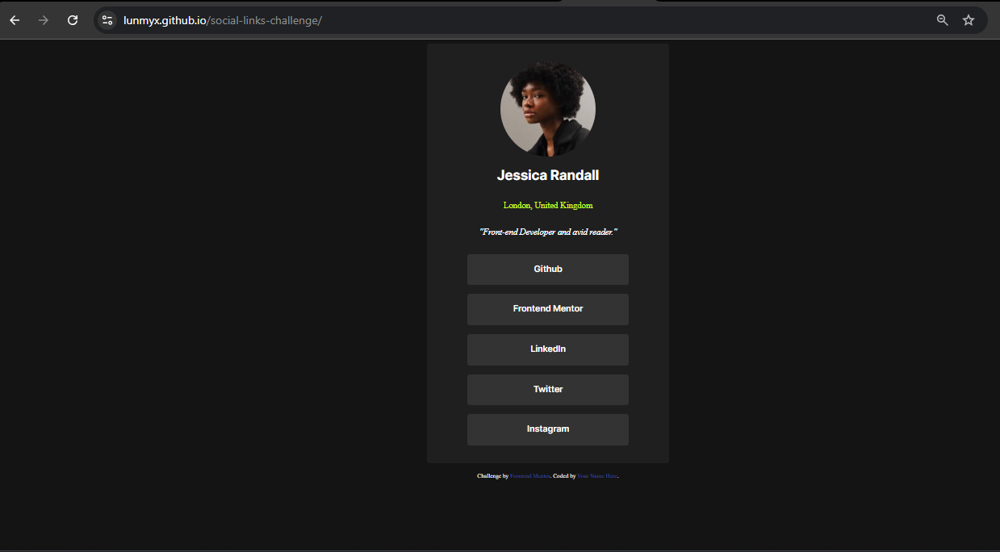

# Frontend Mentor - Social links profile solution

This is a solution to the [Social links profile challenge on Frontend Mentor](https://www.frontendmentor.io/challenges/social-links-profile-UG32l9m6dQ). Frontend Mentor challenges help you improve your coding skills by building realistic projects. 

## Table of contents

- [Overview](#overview)
  - [The challenge](#the-challenge)
  - [Screenshot](#screenshot)
  - [Links](#links)
- [My process](#my-process)
  - [Built with](#built-with)
  - [What I learned](#what-i-learned)
  - [Continued development](#continued-development)
- [Author](#author)

**Note: Delete this note and update the table of contents based on what sections you keep.**

## Overview

### The challenge

Users should be able to:

- See hover and focus states for all interactive elements on the page

### Screenshot

### Links

- Solution URL: [Github Repo](https://github.com/Lunmyx/social-links-challenge)
- Live Site URL: [Social Links Profile Challenge - Github Pages](https://lunmyx.github.io/social-links-challenge/)

## My process

### Built with

- Semantic HTML5 markup
- CSS custom properties
- Mobile-first workflow
- Media Queries

### What I learned

I learned about media queries and font-face, responsive design and about mobile first. Also learned how to properly use Github for repos and setting up a github page to host the website. I also relearned lots of stuff like the use of divs, css classes and effects like transition.

### Continued development

I really want to study more about mobile first and responsiveness and more dynamic effects on interactive elements.

## Author

- Website - [My Github](https://github.com/Lunmyx)
- Frontend Mentor - [@Lunmyx](https://www.frontendmentor.io/profile/Lunmyx)

